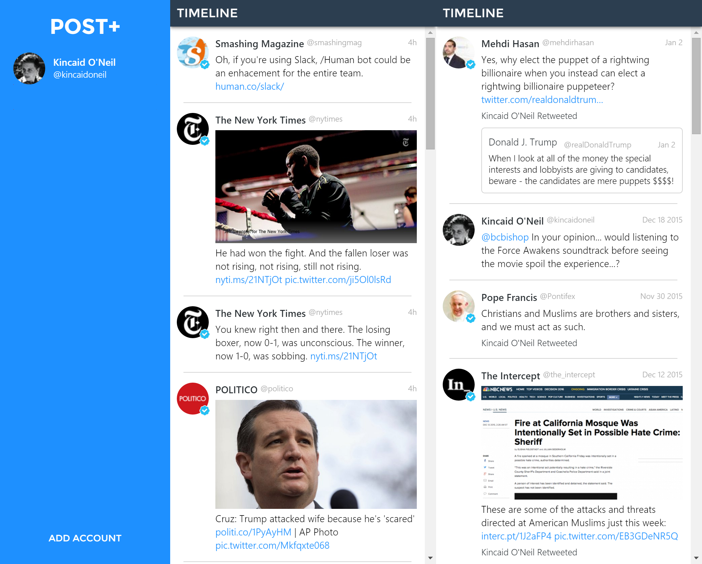

# Post+

Post+ is a native desktop Twitter app built using [Electron](https://electron.atom.io/) and [Vue.js](vuejs.org), inspired by TweetDeck.



**Please note:** The project is no longer being actively developed. While significant functionality is incomplete and/or broken, the basic scaffold, build tools, Vue components, Twitter API integration and rendering of Tweets exists.

### Setup

To enable integration with the Twitter API, replace `consumerSecret`, `consumerKey` and `callbackURL` within `app/modules/store.js`.

```bash
# Start dev server with hot reloading
yarn run dev

# Launch the app
yarn run electron

# Build & minify for production
# Note: this does not generate binaries
yarn run build
```

Copyright &copy; 2017 [Kincaid O'Neil](https://github.com/kincaidoneil). Released under the [MIT license](LICENSE.md).

> [kincaidoneil.com](https://kincaidoneil.com) &bull; Twitter [@kincaidoneil](https://twitter.com/kincaidoneil)
